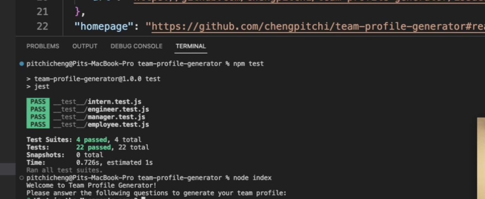
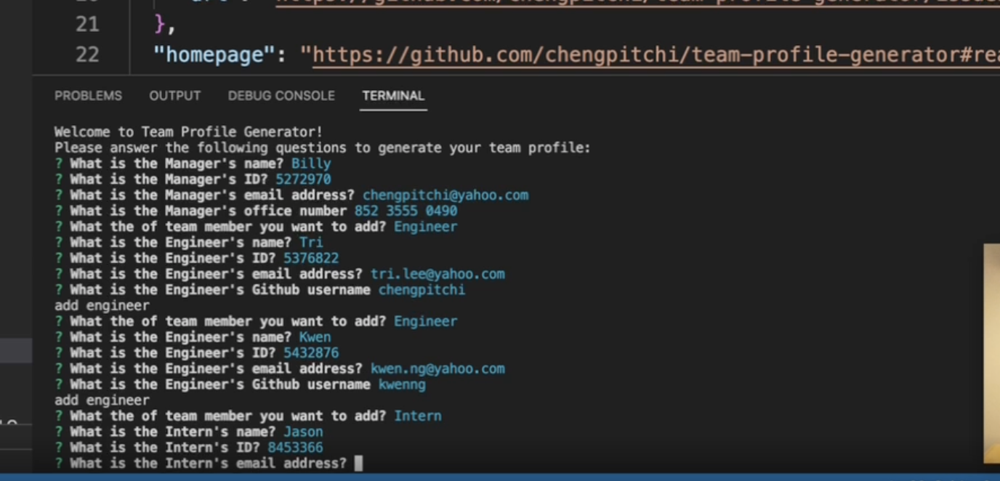
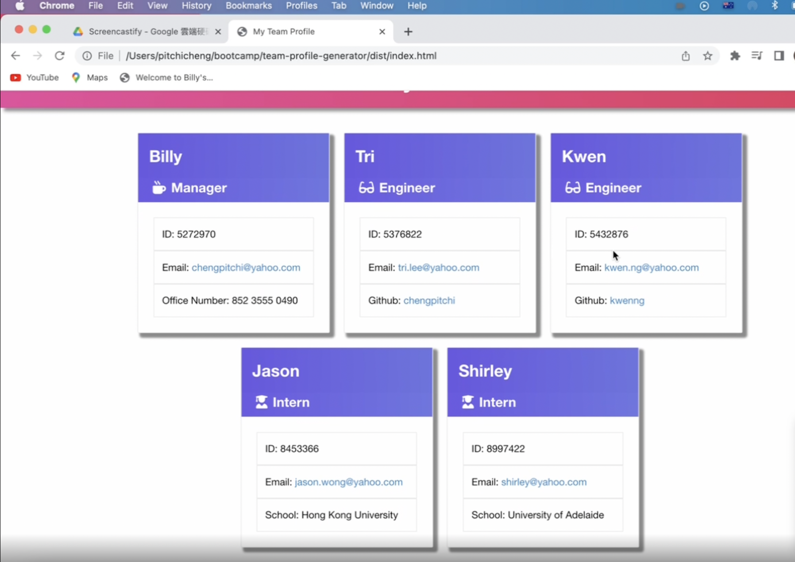

# Team Profile Generator

  [](https://www.javascript.com)

  ## Description 
  > This is a command line application using to generate a html file showing the team profile information.
  

  ## Table of Contents
  
  * [Installation](#installation)
  * [Usage](#usage)
  * [Contributing](#contributing)
  * [Test](#test)
  * [Walkthrough Video](#walkthrough-video)
  * [Screenshots](#screenshots)
  * [Questions](#questions)
  * [Github](#github)
  * [License](#license)
  

  ## Installation
  > Inquirer package is required to run the application.  For running unit test, Jest package is required.  To install necesary dependencies, include the dependencies in the package.json file and run the following command:
  
  ```
  npm i
  ```
  

  ## Usage
  > To start the application, right click the folder and open a terminal in VS code.  Type "node index" in the command line. 
  

  ## Contributing
  > Billy Cheng is currently the sole contributor of this application. To contribue to this application, please contact Bily Cheng by the email address shown below.
  

  ## Test 
  To test the application, please follow the below:

  ```
  You can run the unit test by installing jest.  After installation, type "npm test" in the terminal.
  ```
  ## Walkthrough Video
  
  https://drive.google.com/file/d/17xvmzYeh7iz2Ot9m7NcdAXgtGZXzvJgR/view?usp=sharing
  
  ## Screenshots
  

  

  

  ## Questions
  > Should you have any questions, please send email to chengpitchi@yahoo.com. 
  

  ## Github
  > https://github.com/chengpitchi
  
  
  ## License 
  > This applicaiton is covered under JavaScript.
